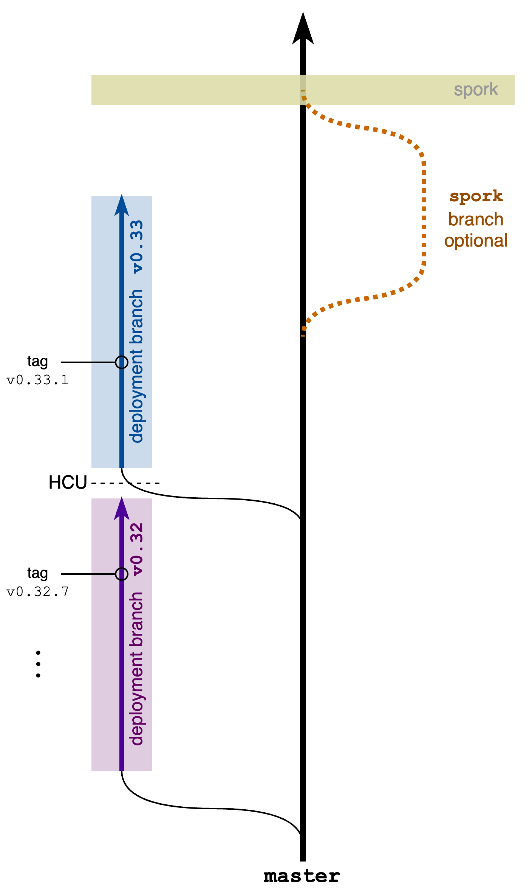

# Development

Please carefully read our [Coding Conventions](./CodingConventions.md).

## Branching Convention

**This convention is _binding_ for all PR requests in this repo!**
Deviating from this convention has a significant risk of compromising mainnet. 
If you feel that the branching convention could be improved, please prepare a concrete proposal and add an agenda item for
a [Core Protocol Working Group](https://github.com/onflow/Flow-Working-Groups/tree/main/core_protocol_working_group) meeting.
 
### Overview
On a conceptual level, we maintain four categories of branches: 
* **deployment branches** contain software versions that was/is/should be running on testnet and mainnet. 
  The naming convention is `v0.minor` and loosely follows semantic versioning. The major version is currently pinned to `0`,
  as the Flow protocol is not yet fully implemented. The minor version increases at every Height-Coordinated-Upgrade [HCU] or spork (points of breaking downwards compatibility).
  In a nutshell, you can think of the minor as a version number for the overall protocol. Each time there is a change in the protocol, such that nodes
  running the old and new version can't be mixed, the minor version increases and we create a new deployment branch
  (usually from `master`).
* `master` accumulates all revisions and features that are either fully downwards compatible or can be rolled out via an HCU. Probably the majority of PRs
  can be merged directly to master or via a feature branch. Furthermore, our ability to roll out upgrades to the live network via HCUs will significantly increase over time.     
* For most **feature branches**, the protocol changes they implement will hopefully be small enough to be deployed via an HCU (and hence can be merged to `master`).
  Though, for the foreseeable future, large and broadly-breaking improvements will be necessary for a fast evolution and feature-completion of Flow.
  Such features should be kept in their individual feature branches.  
* The `spork` branch, will be created in preparation of a new spork from the most recent `master`. Feature branches holding HCU-**in**compatible upgrades will be
  consolidated on this `spork` branch. The spork branch is intended to be very short-lived and only exist for a few weeks right before the testnet spork.
  When the Flow network has committed to the spork on a governance level (at the moment, largely coordinated by the Flow Foundation), the `spork` branch will be
  merged back to `master`.

We are purposefully continuing the usage of the 'spork' terminology here, to describe a "severely breaking change".
Specifically, spork describes a deployment of new node software, which requires the entire network to be stopped and rebooted.
We only carry over a snapshot of the execution state but fully re-initialize the protocol state. Thereby, major upgrades of the protocol,
incl. migrations of the entire execution state to a new formats become reasonably straight forward.
Additional context on HCU vs sporks can be found [here](https://developers.flow.com/networks/node-ops/node-operation/hcu#hcu-versus-spork).   

#### Motivations
* Based on the decentralized nature of blockchain networks, continuous deployment is practically intractable (without compromising decentralization).
Therefore, longer wait times for features until their deployment must be accounted for in the development process. This convention has been incrementally
developed and refined based on the multi-year learnings of managing the deployment of the flow network.
* Deployment branches, `master` containing a runnable snapshot of the most recent development state and feature branches are intuitively exactly what you
  would expect without further flow-specific context. We just _extend_ the common convention by a few edge cases accounting for the upgrade-constraints of a blockchain network:
  * On a specific deployment branch, there can only be non-breaking changes. This is to prevent accidents where we roll out new node
    software incrementally to one node after another, but then discover later that there is some specific case where the two versions don't work together and mainnet halts. 
  * Due to the limitations of upgrades that can be rolled out via HCUs, we have to separate spork-level features. That is the scenario we address with long-living
    feature branches and the spork branch.   
* You may wonder why we don't just use a single spork branch right away. So `master` would contain all HCU-compatible upgrades and the spork-branch _in addition_ also the HCU-**in**compatible upgrades.
  We optimize for the case where the majority of changes is HCU-compatible, while we have very few HCU-incompatible features in the pipeline which in tendency go very deep in one specific area of the code base.
  If we collected the HCU-incompatible features in a single 'spork' branch, we would need to merge master into that. That means an engineer would need to know all HCU-incompatible features
  currently in the pipeline to resolve merge conflicts. In our model where teams develop features in parallel, it has proven to be efficient for each team to maintain their own HCU-incompatible feature
  branches and regularly merge the evolving `master` into them. As feature branches stay aligned with `master`, the last remaining step of merging all the feature branches together is usually not a big lift.      
* During the limited lifetime of the `spork` branch, the evolution of `master` should be very small. Generally, the engineering team is more focused on testing, a significant portion of features will have
  completed their development in time for the spork and new features start in their own branches anyway.      

### The [master](https://github.com/onflow/flow-go/tree/master) branch

The `master` branch is intended to only contain features for the _immediately_ upcoming release.
This is under the assumption that we already committed to the type of upgrade (HCU vs Spork).

**Generally only HCU-compatible changes are allowed to be merged to `master`**. It is the responsibilities of the developers to provide conclusive evidence why
their change can be deployed via HCU. For fully downwards-compatible changes, this explanation can be omitted. Otherwise, please provide a brief summary in your PR
targeting master as of why the code changes are HCU-compatible (for example "only affects transaction execution and verification"). More details are provided in the 
[breaking change classification](#breaking-change-classifications) section below.

### Deployment branches

- For every HCU and spork, a new deployment branch will be created from master. This branch will be tagged and used to update testnet and then mainnet.
- **Only non-breaking changes** can be committed to a deployment branch, such that nodes running the older and newer version on this branch can be mixed.
  In other words, a single deployment branch spans _all_ patches that are protocol-compatible without an HCU. 
- Each time there is a breaking-change in the protocol (see [breaking change classification](#breaking-change-classifications) below),
  the minor version increases and we create a new deployment branch from `master`.

#### Naming Convention:
The naming convention is `v0.minor`, with the major version currently pinned to `0`.
The minor version increments at every Height-Coordinated-Upgrade [HCU] or spork (points of breaking downwards compatibility).
An example is the branch `v0.33`. Extensions of the branch names are allowed but optional, for example including key differences
such as cryptographic stack (e.g. `v0.33-relic`), storage implementation (e.g. `v0.33-storehouse`), etc.  Patch versions (e.g. `0.33.0`) are usually only included in tags and builds. 
 

### Feature branches
- During development, all features should live on a feature branch.
- For small features, this will be a simple working branch. These branches have the naming scheme `<contributor>/<issue #>-<short description>`, for example `kan/123-fix-known-issue`
- For larger features, this may be a shared feature branch with other team members. Feature branches have the naming scheme `feature/<name>`.

### The `spork` branch

The spork branch was specifically introduced for managing spork-level changes. Sporks are very far apart (targeted at 12 months intervals), so the `spork` branch is not needed for the time in between sporks.
HCU-compatible features are merged to `master` and HCU-incompatible features live in their own feature branches until shortly before the spork.
In an ideal world, where we finalize the spork date a few months ahead of time and _always_ stick to it, the `spork` branch would not be needed at all. 

Despite our best efforts, occasionally circumstances arise that require us to postpone the spork just a few weeks before it was supposed to happen.
In fact, given the magnitude and depth of changes being rolled out in a spork, needing to postpone with short notice is actually a reasonably plausible scenario.
And the `spork` branch helps us to handle this scenario: 

Unless we are absolutely sure the spork is going to happen when planned, limit `master` to HCU-compatible changes only. Thereby we keep our options open
to postpone the spork and if needed to continue with HCUs (e.g. for time-sensitive security fixes). However, we also need to consolidate our
HCU-**in**compatible (major breaking) changes, resolve conflicts and test to keep our options open for actually sporking on the planned date,
which we do on the `spork` branch. 

## Upgrade Path Eligibility

- When a feature branch is ready to be merged, the desired upgrade path onto Mainnet must be determined (if any). The options are:
    - Height Coordinated Upgrade (HCU)
        - No protocol-level breaking changes
        - No state migrations
        - Changes to how Execution state/path are handled are allowed if they are
            - Backwards compatible, or
            - Brand new additions
        - Resource optimizations are okay
        - Cadence upgrades which could cause execution state fork (likely any Cadence upgrade except for trivial changes)
    - Spork
        - Protocol level breaking change
        - State migrations required
- All HCU upgrades can go directly into the `master` branch
- All spork upgrades must live on their own feature branch until the last HCU before the spork has been performed (usually approximately 1 month before the Spork).
    - It is the responsibility of the DRI to keep this feature branch in a mergeable state.
    - If the spork is scheduled to occur within a month, all the feature branches can be merged into `master`.
      However, if the exact spork date has not been decided, then a special `spork` branch may be created from master to merge all the feature branches.
      This is to consolidate all the feature branches while accommodating any additional HCUs that may occur between then and the spork date.
    - Suggestion: once a sprint, merge `master` into the feature branch. More frequent merges are easier, as they avoid complex conflict resolutions

## End of Release Cycle

- At the end of every release cycle, we will tag a commit that includes all desired features to be released
- This commit will be tagged according to [semantic versioning guidelines](https://dapperlabs.notion.site/Changes-to-handling-git-tags-5e39af7c723a428a915bd88901fc1274)
- Release notes must be written up, describing all features included in this tag

## Benchmark Testing

[Benchmarking](https://www.notion.so/Benchmarking-e3d89e3aadb44b0787da9bb7703b0dae?pvs=21)

- All features on the release candidate tag must undergo testing on `benchmarknet`

### Testnet

- The current schedule is the Wednesday two weeks before the corresponding Mainnet spork
- Features should aim to live on Testnet for at least two weeks before making it to Mainnet

### Mainnet

- Features must live on Testnet for two week before making it to Mainnet
- The current schedule is the Wednesday two weeks after the Testnet Spork

## Breaking Change Classifications

### Acceptable Changes for HCU

- All backward compatible changes
- Breaking changes only pertaining to the execution of future transactions
    - Many Cadence related breaking changes would fall in this category
    - FVM changes may also fall here
- Breaking changes only pertaining to the verification of future transactions

### Spork only changes

- Any change that requires a state migration
    - i.e. something changing in how the historical state will be read and interacted with
- Any change that would break the communication contract between nodes
    - e.g. Addition of a new REQUIRED field in a message structure
    - Removal of a REQUIRED channel in libp2p
    - Removal of a REQUIRED field in a message structure
        -  Generally, *all* the fields in our node-to-node messages are required.
        -  For BFT reasons we avoid optional fields, as they add surface for spamming attacks, impose additional consistency requirements, and they often add security vulnerabilities w.r.t. the message hash/ID. 
    - Most changes of the core protocol outside of execution, such as changes in the consensus algorithm, verification-and-sealing pipeline, or collector mechanics.
        - For any protocol-related changes, you need to have a solid argument for why this change is non-breaking (absence of a counter-example is not sufficient).
    - Changes in the [Service Events](https://www.notion.so/Service-Events-54e5edb7515445f293dff36ade910ad7?pvs=21) that are emitted by the Execution environment and ingested by the protocol
    - Change in the reading of Protocol state that is not backwards compatible
        - e.g. If the way the node interprets identities loaded from storage is changed so that identities stored before an upgrade is no longer recognized after the upgrade, this is not acceptable for an HCU
