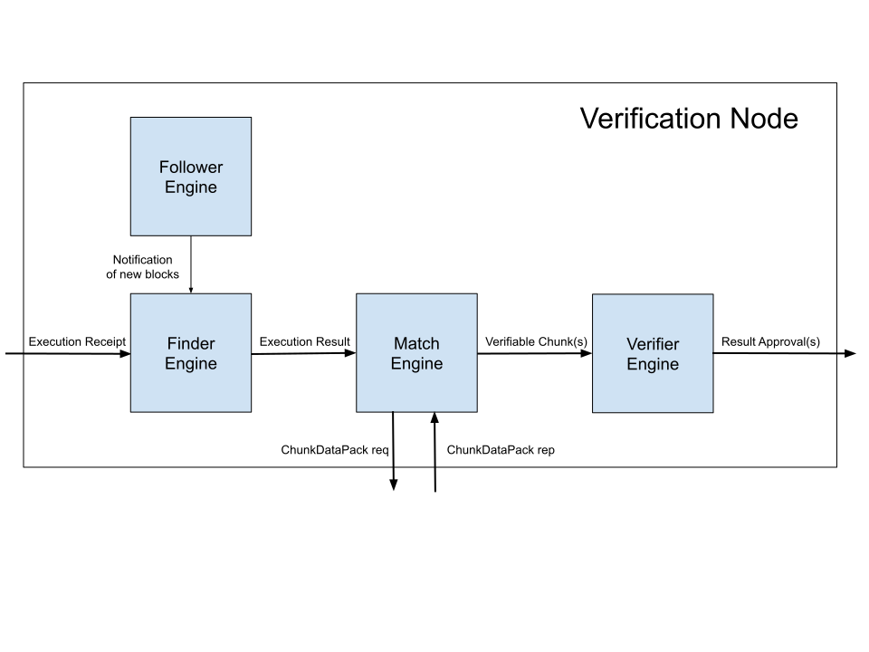

# Verification
## Overview
Verification nodes (VN) are responsible for verifying the correctness of execution results, generated by execution nodes as a result of running all collections inside a block. An execution node wraps each execution result by a container called "execution receipt" and broadcasts it to verification nodes. 

In this document, we provide a high-level overview of the verification node's architecture. Each section includes links to the appropriate package, which may contain more detailed documentation.

**Table of Contents**

- [Terminologies](#terminologies)
  - [Execution Result](#execution-result)
  - [Chunk](#chunk)
  - [Execution Receipt](#execution-receipt)
  - [Chunk Data Pack](#chunk-data-pack)
  - [Verifiable Chunk](#verifiable-chunk)
  - [Result Approval](#result-approval)
- [Software Architecture](#software-architecture)
  - [Follower Engine](#follower-engine)
  - [Finder Engine](#finder-engine)
  - [Match Engine](#match-engine)
  - [Verifier Engine](#verifier-engine)

## Terminologies

### [Execution Result](../../model/flow/executionResult.go)
An execution result represents a commitment from an execution node to the interim and final states of computing the corresponding block, which is referenced by the execution receipt. 

### [Chunk](../../model/flow/chunk.go)
Each execution result includes smaller units called [chunks](../../model/flow/chunk.go), each assigned to multiple verification nodes for verification. Each Verification Node only checks a small fraction of chunks through a [publicly verifiable and deterministic chunk assignment](../../module/chunks/publicAssign.go) algorithm.

### [Execution Receipt](../../model/flow/executionReceipt.go)
An execution receipt is a signed version of an execution result, which provides authentication of the sender, guarantees the integrity of the message and a Specialized Proof of Confidential Knowledge (SPoCK). The execution receipts are broadcasted to the verification and consensus nodes.

### [Chunk Data Package](../../model/flow/chunk.go)
As mentioned each chunk is assigned to multiple verification nodes. In order to be able to verify a chunk, a verification node sends a request for a chunk data package which includes all the data and proofs needed to verify a chunk.

### [Verifiable Chunk](../../engine/verification/messages.go)
A "Verifiable Chunk" is an internal data structure of the verification nodes in Flow. A verifiable chunk is associated with a chunk of an execution result. It contains all information required to verify the correctness of execution state transition affected by that chunk.

### [Result Approval](../../model/flow/resultApproval.go)
Verification node generates and broadcasts a "Result Approval" to the consensus nodes. A result approval is associated with a specific chunk of an execution result. It implies that the verification node has successfully verified the transition of the execution state represented by this chunk.
 
## Software Architecture

The above figure represents the software architecture of a Verification Node in Flow. The Verification Node is made up of four engines known as *Follower*, *Finder*, *Match*, and *Verifier* engines. 

### [Follower Engine](../../engine/common/follower)
The Follower engine follows the consensus progress and notifies the Finder engine of any new finalized block.

### [Finder Engine](../../engine/verification/finder)
The Finder engine receives broadcasted execution receipts from execution nodes as well as finalized blocks from the follower engine. It passes the execution result of each received execution receipt to the match engine if it satisfies the following two conditions: 
- The execution result refers to a finalized block.
- The finder engine has not processed this execution result earlier.

By _processing_ an execution result, we mean the finder engine passing it successfully to the match engine. The Finder engine is concurrency-safe and ensures that it sends each execution result at most once to the match engine. In other words, it never tries passing a duplicate execution result that it has already processed. 
     
### [Match Engine](../../engine/verification/match)
On receiving an execution result from the finder engine, the match engine performs the [chunk assignment](../../module/chunks/publicAssign.go) algorithm and determines the chunks assigned to this verification node. 
For each assigned chunk, it then asks the execution node for its corresponding chunk data pack. Once the match engine receives a chunk data pack for an assigned chunk, it constructs a verifiable chunk for it and passes it to the verifier engine. Once a verifiable chunk is successfully passed to the verifier engine, its corresponding chunk is marked as a _matched_ chunk. Match engine considers a timeout for each chunk data pack request and retries the timed out chunk data pack requests a few times. It, however, guarantees to match each assigned chunk at most once, i.e., it never repeats passing a verifiable chunk for an already matched chunk. 

### [Verifier Engine](../../engine/verification/verifier)
On receiving a verifiable chunk from the Match engine, the verifier engine performs the *verification* process. The verification process happens by executing all the transactions included in the chunk and verifying the correctness of the execution state transition affected by the chunk. If the chunk passes the verification process, the verifier engine generates a result approval for it and broadcasts it to all consensus nodes. 

 
