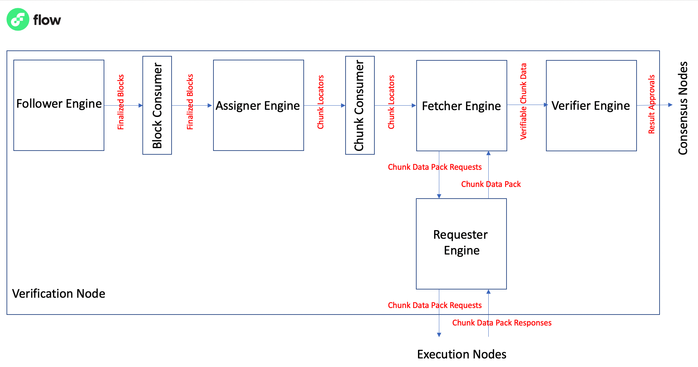

# Verification Node
The Verification Node in the Flow blockchain network is a critical component responsible for
verifying `ExecutionResult`s and generating `ResultApproval`s. 
Its primary role is to ensure the integrity and validity of block execution by performing verification processes.
In a nutshell, the Verification Node is responsible for the following:
1. Following the chain for new finalized blocks (`Follower` engine).
2. Processing the execution results in the finalized blocks and determining assigned chunks to the node (`Assigner` engine).
3. Requesting chunk data pack from Execution Nodes for the assigned chunks (`Fetcher` and `Requester` engines).
4. Verifying the assigned chunks and emitting `ResultApproval`s for the verified chunks to Consensus Nodes (`Verifier` engine).


   
## Block Consumer ([consumer.go](verification%2Fassigner%2Fblockconsumer%2Fconsumer.go))
The `blockconsumer` package efficiently manages the processing of finalized blocks in Verification Node of Flow blockchain.
Specifically, it listens for notifications from the `Follower` engine regarding finalized blocks, and systematically 
queues these blocks for processing. The package employs parallel workers, each an instance of the `Assigner` engine, 
to fetch and process blocks from the queue. The `BlockConsumer` diligently coordinates this process by only assigning 
a new block to a worker once it has completed processing its current block and signaled its availability. 
This ensures that the processing is not only methodical but also resilient to any node crashes. 
In case of a crash, the `BlockConsumer` resumes from where it left off by reading the processed block index from storage, reassigning blocks from the queue to workers,
thereby guaranteeing no loss of data.

## Assigner Engine 
The `Assigner` [engine](verification%2Fassigner%2Fengine.go) is an integral part of the verification process in Flow, 
focusing on processing the execution results in the finalized blocks, performing chunk assignments on the results, and
queuing the assigned chunks for further processing. The Assigner engine is a worker of the `BlockConsumer` engine,
which assigns finalized blocks to the Assigner engine for processing.
This engine reads execution receipts included in each finalized block, 
determines which chunks are assigned to the node for verification, 
and stores the assigned chunks into the chunks queue for further processing (by the `Fetcher` engine).

The core behavior of the Assigner engine is implemented in the `ProcessFinalizedBlock` function. 
This function initiates the process of execution receipt indexing, chunk assignment, and processing the assigned chunks. 
For every receipt in the block, the engine determines chunk assignments using the verifiable chunk assignment algorithm of Flow.
Each assigned chunk is then processed by the `processChunk` method. This method is responsible for storing a chunk locator in the chunks queue, 
which is a crucial step for further processing of the chunks by the fetcher engine. 
Deduplication of chunk locators is handled by the chunks queue.
The Assigner engine provides robustness by handling the situation where a node is not authorized at a specific block ID. 
It verifies the role of the result executor, checks if the node has been ejected, and assesses the node's staked weight before granting authorization.
Lastly, once the Assigner engine has completed processing the receipts in a block, it sends a notification to the block consumer. This is inline with 
Assigner engine as a worker of the block consumer informing the consumer that it is ready to process the next block.
This ensures a smooth and efficient flow of data in the system, promoting consistency across different parts of the Flow architecture.

### Chunk Locator
A chunk locator in the Flow blockchain is an internal structure of the Verification Nodes that points to a specific chunk 
within a specific execution result of a block. It's an important part of the verification process in the Flow network,
allowing verification nodes to efficiently identify, retrieve, and verify individual chunks of computation.

```go
type ChunkLocator struct {
    ResultID flow.Identifier // The identifier of the ExecutionResult
    Index    uint64         // Index of the chunk
}
```
- `ResultID`: This is the identifier of the execution result that the chunk is a part of. The execution result contains a list of chunks which each represent a portion of the computation carried out by execution nodes. Each execution result is linked to a specific block in the blockchain.
- `Index`: This is the index of the chunk within the execution result's list of chunks. It's an easy way to refer to a specific chunk within a specific execution result.

**Note-1**: The `ChunkLocator` doesn't contain the chunk itself but points to where the chunk can be found. In the context of the `Assigner` engine, the `ChunkLocator` is stored in a queue after chunk assignment is done, so the `Fetcher` engine can later retrieve the chunk for verification.
**Note-2**: The `ChunkLocator` is never meant to be sent over the networking layer to another Flow node. It's an internal structure of the verification nodes, and it's only used for internal communication between the `Assigner` and `Fetcher` engines.


## ChunkConsumer 
The `ChunkConsumer` ([consumer](verification%2Ffetcher%2Fchunkconsumer%2Fconsumer.go)) package orchestrates the processing of chunks in the Verification Node of the Flow blockchain. 
Specifically, it keeps tabs on chunks that are assigned for processing by the `Assigner` engine and systematically enqueues these chunks for further handling. 
To expedite the processing, the package deploys parallel workers, with each worker being an instance of the `Fetcher` engine, which retrieves and processes the chunks from the queue. 
The `ChunkConsumer` administers this process by ensuring that a new chunk is assigned to a worker only after it has finalized processing its current chunk and signaled that it is ready for more. 
This systematic approach guarantees not only efficiency but also robustness against any node failures. In an event where a node crashes,
the `ChunkConsumer` picks up right where it left, redistributing chunks from the queue to the workers, ensuring that there is no loss of data or progress.

## Fetcher Engine - The Journey of a `ChunkLocator` to a `VerifiableChunkData`
The Fetcher [engine.go](fetcher%2Fengine.go) of the Verification Nodes focuses on the lifecycle of a `ChunkLocator` as it transitions into a `VerifiableChunkData`.

### `VerifiableChunkData`
`VerifiableChunkData` refers to a data structure that encapsulates all the necessary components and resources required to
verify a chunk within the Flow blockchain network. It represents a chunk that has undergone processing and is ready for verification.

The `VerifiableChunkData` object contains the following key elements:
```go
type VerifiableChunkData struct {
	IsSystemChunk     bool                  // indicates whether this is a system chunk
	Chunk             *flow.Chunk           // the chunk to be verified
	Header            *flow.Header          // BlockHeader that contains this chunk
	Result            *flow.ExecutionResult // execution result of this block
	ChunkDataPack     *flow.ChunkDataPack   // chunk data package needed to verify this chunk
	EndState          flow.StateCommitment  // state commitment at the end of this chunk
	TransactionOffset uint32                // index of the first transaction in a chunk within a block
}
```
1. `IsSystemChunk`: A boolean value that indicates whether the chunk is a system chunk. System chunk is a specific chunk typically representing the last chunk within an execution result.
2. `Chunk`: The actual chunk that needs to be verified. It contains the relevant data and instructions related to the execution of transactions within the blockchain.
3. `Header`: The `BlockHeader` associated with the chunk. It provides important contextual information about the block that the chunk belongs to.
4. `Result`: The `ExecutionResult` object that corresponds to the execution of the block containing the chunk. It contains information about the execution status, including any errors or exceptions encountered during the execution process.
5. `ChunkDataPack`: The `ChunkDataPack`, which is a package containing additional data and resources specific to the chunk being verified. It provides supplementary information required for the verification process.
6. `EndState`: The state commitment at the end of the chunk. It represents the final state of the blockchain after executing all the transactions within the chunk.
7. `TransactionOffset`: An index indicating the position of the first transaction within the chunk in relation to the entire block. This offset helps in locating and tracking individual transactions within the blockchain.
By combining these elements, the VerifiableChunkData object forms a comprehensive representation of a chunk ready for verification. It serves as an input to the `Verifier` engine, which utilizes this data to perform the necessary checks and validations to ensure the integrity and correctness of the chunk within the Flow blockchain network.

### The Journey of a `ChunkLocator` to a `VerifiableChunkData`
Upon receiving the `ChunkLocator`, the `Fetcher` engine’s `validateAuthorizedExecutionNodeAtBlockID` function is responsible 
for validating the authenticity of the sender. It evaluates whether the sender is an authorized execution node for the respective block. 
The function cross-references the sender’s credentials against the state snapshot of the specific block. 
In the case of unauthorized or invalid credentials, an error is logged, and the `ChunkLocator` is rejected. 
For authorized credentials, the processing continues.

Once authenticated, the `ChunkLocator` is utilized to retrieve the associated Chunk Data Pack. 
The `requestChunkDataPack` function takes the Chunk Locator and generates a `ChunkDataPackRequest`. 
During this stage, the function segregates execution nodes into two categories - those which agree with the execution result (`agrees`) and those which do not (`disagrees`). 
This information is encapsulated within the `ChunkDataPackRequest` and is forwarded to the `Requester` Engine. 
The `Requester` Engine handles the retrieval of the `ChunkDataPack` from the network of execution nodes.

After the Chunk Data Pack is successfully retrieved by the `Requester` Engine,
the next phase involves structuring this data for verification and constructing a `VerifiableChunkData`. 
It’s imperative that this construction is performed with utmost accuracy to ensure that the data is in a state that can be properly verified.

The final step in the lifecycle is forwarding the `VerifiableChunkData` to the `Verifier` Engine. The `Verifier` Engine is tasked with the critical function 
of thoroughly analyzing and verifying the data. Depending on the outcome of this verification process, 
the chunk may either pass verification successfully or be rejected due to discrepancies.

### Handling Sealed Chunks
In parallel, the `Fetcher` engine remains vigilant regarding the sealed status of chunks. 
The `NotifyChunkDataPackSealed` function monitors the sealing status.
If the Consensus Nodes seal a chunk, this function ensures that the `Fetcher` Engine acknowledges this update and discards the respective 
`ChunkDataPack` from its processing pipeline as it is now sealed (i.e., has been verified by an acceptable quota of Verification Nodes).

## Requester Engine - Retrieving the `ChunkDataPack`
The `Requester` [engine](requester%2Frequester.go) is responsible for handling the request and retrieval of chunk data packs in the Flow blockchain network.
It acts as an intermediary between the `Fetcher` engine and the Execution Nodes, facilitating the communication and coordination required 
to obtain the necessary `ChunkDataPack` for verification.

The `Requester` engine receives `ChunkDataPackRequest`s from the `Fetcher`. 
These requests contain information such as the chunk ID, block height, agree and disagree executors, and other relevant details.
Upon receiving a `ChunkDataPackRequest`, the `Requester` engine adds it to the pending requests cache for tracking and further processing.
The Requester engine periodically checks the pending chunk data pack requests and dispatches them to the Execution Nodes for retrieval. 
It ensures that only qualified requests are dispatched based on certain criteria, such as the chunk ID and request history.
The dispatching process involves creating a `ChunkDataRequest` message and publishing it to the network. 
The request is sent to a selected number of Execution Nodes, determined by the `requestTargets` parameter.

When an Execution Node receives a `ChunkDataPackRequest`, it processes the request and generates a `ChunkDataResponse` 
message containing the requested chunk data pack. The execution node sends this response back to the`Requester` engine.
The `Requester` engine receives the chunk data pack response, verifies its integrity, and passes it to the registered `ChunkDataPackHandler`, 
i.e., the `Fetcher` engine.

### Retry and Backoff Mechanism
In case a `ChunkDataPackRequest` does not receive a response within a certain period, the `Requester` engine retries the request to ensure data retrieval.
It implements an exponential backoff mechanism for retrying failed requests.
The retry interval, backoff multiplier, and backoff intervals can be customized using the respective configuration parameters.

### Handling Sealed Blocks
If a `ChunkDataPackRequest` pertains to a block that has already been sealed, the `Requester` engine recognizes this and 
removes the corresponding request from the pending requests cache. 
It notifies the `ChunkDataPackHandler` (i.e., the `Fetcher` engine) about the sealing of the block to ensure proper handling.

### Parallel Chunk Data Pack Retrieval
The `Requester` processes a number of chunk data pack requests in parallel, 
dispatching them to execution nodes and handling the received responses. 
However, it is important to note that if a chunk data pack request does not receive a response from the execution nodes, 
the `Requester` engine can become stuck in processing, waiting for the missing chunk data pack. 
To mitigate this, the engine implements a retry and backoff mechanism, ensuring that requests are retried and backed off if necessary. 
This mechanism helps to prevent prolonged waiting and allows the engine to continue processing other requests while waiting for the missing chunk data pack response.

## Verifier Engine - Verifying Chunks
The `Verifier` [engine](verifier%2Fengine.go) is responsible for verifying chunks, generating `ResultApproval`s, and maintaining a cache of `ResultApproval`s. 
It receives verifiable chunks along with the necessary data for verification, verifies the chunks by constructing a partial trie,
executing transactions, and checking the final state commitment and other chunk metadata. 
If the verification is successful, it generates a `ResultApproval` and broadcasts it to the consensus nodes.

The `Verifier` Engine offers the following key features:
1. **Verification of Chunks**: The engine receives verifiable chunks, which include the chunk to be verified, the associated header, execution result, and chunk data pack. It performs the verification process, which involves constructing a partial trie, executing transactions, and checking the final state commitment. The verification process ensures the integrity and validity of the chunk.
2. **Generation of Result Approvals**: If the verification process is successful, the engine generates a result approval for the verified chunk. The result approval includes the block ID, execution result ID, chunk index, attestation, approver ID, attestation signature, and SPoCK (Secure Proof of Confidential Knowledge) signature. The result approval provides a cryptographic proof of the chunk's validity and is used to seal the block.
3. **Cache of Result Approvals**: The engine maintains a cache of result approvals for efficient retrieval and lookup. The result approvals are stored in a storage module, allowing quick access to the approvals associated with specific chunks and execution results.
