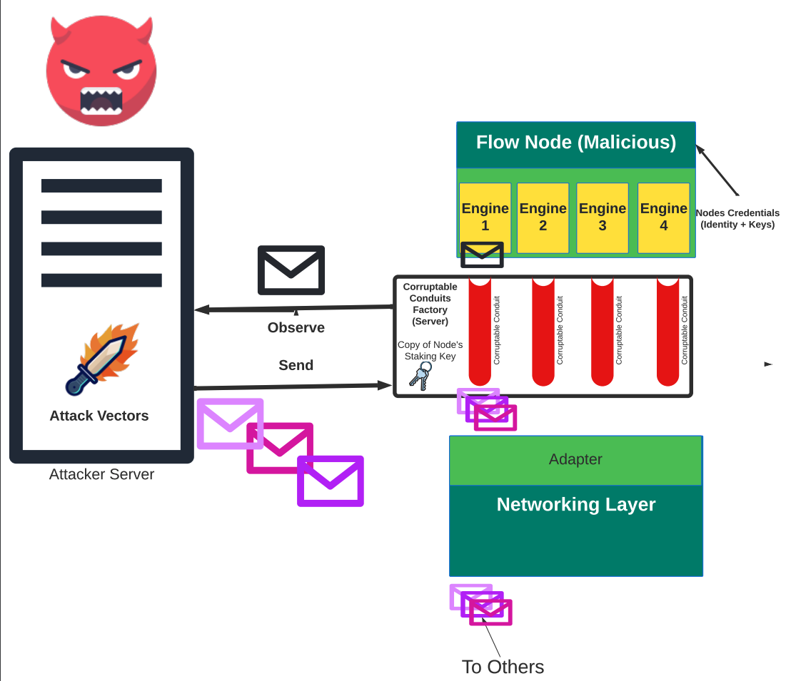

# Corrupt Network Framework

Corrupt Network Framework (CNF) is an integration testing framework for Byzantine Fault Tolerant (BFT) setups.
A corrupt network (cn) is configured on each node that is meant to play _malicious_ during the test scenario. 
The CN utilizes corrupt conduits (cc)s to connect the engines of its node to the networking adaptor.
In contrast to the normal conduits, the CCs do not relay the events from their engine to the network adaptor. 
Instead, they relay the events from their engine to the CN. On receiving an event from a CC, the CN forwards 
the message to a remote attacker. The attacker is in charge of orchestrating specific attacks through its 
programmable attack vectors. The attacker controls the set of malicious nodes. 
All messages from engines of attacker-controlled corrupt nodes are directly wired to the attacker. 
The attacker runs its registered attack vectors on each received message from its corrupt nodes' engines. 
As the result of running the attack vectors, the attacker may ask CN of some corrupt nodes to send some certain messages on its behalf.
In this way, the Corrupt Network empowers testing attack vectors by just replacing the default conduit factory of malicious nodes
with a CN, and without any further modification to the application-layer implementation of the node. 

