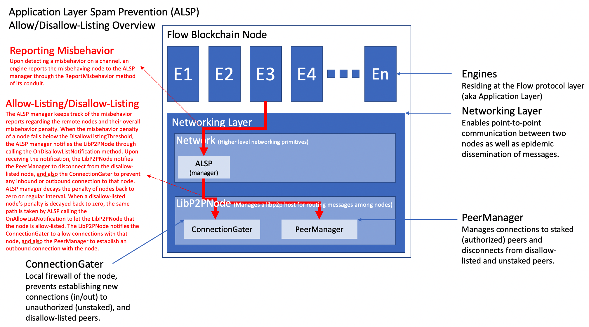

# Application Layer Spam Prevention (ASLP) Manager
Implementation of ALSP manager is available here: [manager.go](manager.go)
Note that this readme is primarily focusing on the ALSP manager. For more details regarding the ALSP system please refer to [readme.md](..%2Freadme.md).
---
## Architectural Overview
### Reporting Misbehavior and Managing Node Penalties
Figure below illustrates the ALSP manager’s role in the reporting of misbehavior and the management of node penalties as
well as the interactions between the ALSP manager and the `LibP2PNode`, `ConnectionGater`, and `PeerManager` components for 
the disallow listing and allow listing processes.

#### Reporting Misbehavior
In the event that an engine detects misbehavior within a channel, 
it is imperative to report this finding to the ALSP manager. 
This is achieved by invoking the `ReportMisbehavior` method on the conduit corresponding to the engine.

#### Managing Penalties
The ALSP manager is responsible for maintaining records of misbehavior reports associated with
remote nodes and for calculating their accumulated misbehavior penalties. 
Should a node’s misbehavior penalty surpass a certain threshold 
(referred to as `DisallowListingThreshold`), the ALSP manager initiates the disallow listing process. When a remote node is disallow-listed,
it is effectively isolated from the network by the `ConnectionGater` and `PeerManager` components, i.e., the existing 
connections to that remote node are closed and new connections attempts are rejected.

##### Disallow Listing Process
1. The ALSP manager communicates with the `LibP2PNode` by calling its `OnDisallowListNotification` method to indicate that a particular remote node has been disallow-listed.
2. In response, the `LibP2PNode` takes two important actions:

   a. It alerts the `PeerManager`, instructing it to sever the connection with the disallow-listed node.
   b. It notifies the `ConnectionGater` to block any incoming or outgoing connections to and from the disallow-listed node.
This ensures that the disallow-listed node is effectively isolated from the local node's network.

##### Penalty Decay and Allow Listing Process
The ALSP manager also includes a penalty decay mechanism, which gradually reduces the penalties of nodes over time upon regular heartbeat intervals (default is every one second).
Once a disallow-listed node's penalty decays back to zero, the node can be reintegrated into the network through the allow listing process. The allow-listing process involves allowing
the `ConnectionGater` to lift the block on the disallow-listed node and instructing the `PeerManager` to initiate an outbound connection with the allow-listed node.

1. The ALSP manager calls the `OnAllowListNotification` method on the `LibP2PNode` to signify that a previously disallow-listed node is now allow-listed.
2. The `LibP2PNode` responds by:

   a. Instructing the `ConnectionGater` to lift the block, thereby permitting connections with the now allow-listed node.
   b. Requesting the `PeerManager` to initiate an outbound connection with the allow-listed node.

This series of actions allows the rehabilitated node to be reintegrated and actively participate in the network once again.

---


## Developer Guidelines
The ALSP (Application Layer Spam Prevention) Manager handles application layer spamming misbehavior reports and penalizes misbehaving nodes. It also disallow-lists nodes whose penalties drop below a threshold.


- **Misbehavior Reports**: When a local engine detects a spamming misbehavior of a remote node, it sends a report to the ALSP manager, by invoking the `HandleMisbehaviorReport` method of the corresponding
conduit on which the misbehavior was detected. The manager handles the report in a thread-safe and non-blocking manner, using worker pools.

```go
func (m *MisbehaviorReportManager) HandleMisbehaviorReport(channel channels.Channel, report network.MisbehaviorReport) {
    // Handle the report
}
```

- **Penalties**: Misbehaving nodes are penalized by the manager. 
The manager keeps a cache of records with penalties for each node. 
The penalties are decayed over time through periodic heartbeats.

- **Disallow-listing**: Nodes whose penalties drop below a threshold are disallow-listed.

- **Heartbeats**: Periodic heartbeats allow the manager to perform recurring tasks, such as decaying the penalties of misbehaving nodes.
```go
func (m *MisbehaviorReportManager) heartbeatLoop(ctx irrecoverable.SignalerContext, interval time.Duration) {
    // Handle heartbeats
}
```

- **Disallow-list Notification Consumer**: is the interface of the consumer of disallow-list notifications, which is 
responsible for taking actions when a node is disallow-listed, i.e., closing exisitng connections with the remote disallow-listed 
node and blocking any incoming or outgoing connections to that node. The consumer is passed to the manager when it is created.
In the current implementation the consumer is the instance of the `LibP2PNode` component of the node.
```go
disallowListingConsumer network.DisallowListNotificationConsumer
```

### Configuration
The configuration includes settings like cache size, heartbeat intervals, and network type.