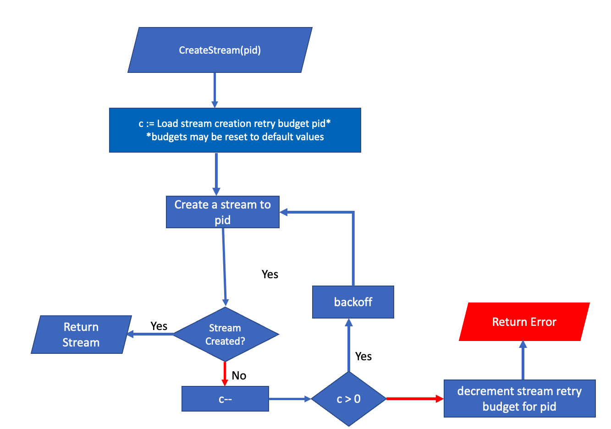

# Unicast Manager

## Overview
In Flow blockchain, nodes communicate with each other in 3 different ways; `unicast`, `multicast`, and `publish`.
The `multicast` and `publish` are handled by the pubsub (GossipSub) protocol.
The `unicast` is a protocol that is used to send messages over direct (one-to-one) connections to remote nodes.
Each `unicast` message is sent through a single-used, one-time stream. One can see a stream as a virtual protocol
that expands the base direct connection into a full-duplex communication channel.
Figure below illustrates the notion of direct connection and streams between nodes A and B. The direct 
connection is established between the nodes and then the nodes can open multiple streams over the connection.
The streams are shown with dashed green lines, while the direct connection is illustrated by blue lines that
encapsulates the streams.


The `unicast` `Manager` is responsible for _establishing_ streams between nodes when they need to communicate
over `unicast` protocol. When the manager receives a `CreateStream` invocation, it will try to establish a stream to the
remote `peer` whose identifier is provided in the invocation (`peer.ID`). The manager is expanding the libp2p
functionalities, hence, it operates on the notion of the `peer` (rather than Flow node), and `peer.ID` rather
than `flow.Identifier`. It is the responsibility of the caller to provide the correct `peer.ID` of the remote
node. 

If there is existing connection between the local node and the remote node, the manager will try to establish
a connection first, and then open a stream over the connection. The connection is assumed persistent, i.e., it
will be kept until certain events such as Flow node shutdown, restart, disallow-listing of either ends of the connection
by each other, etc. However, a stream is a one-time communication channel, i.e., it is assumed to be closed 
by the caller once the message is sent. The caller (i.e., the Flow node) does not necessarily re-use a stream, and the 
`Manager` creates one stream per request (i.e., `CreateStream` invocation), which is typically a single message.
However, we have certain safeguards in place to prevent nodes from establishing more than one connection to each other.
That is why the `Manager` establishes the connection only when there is no existing connection between the nodes, and otherwise
re-uses the existing connection.

Note: `pubsub` protocol also establishes connections between nodes to exchange gossip messages with each other.
The connection type is the same between `pubsub` and `unicast` protocols, as they both consult the underlying LibP2P node to
establish the connection. However, the level of reliability, life-cycle, and other aspects of the connections are different
between the two protocols. For example, `pubsub` requires some _number_ of connections to some _number_ of peers, which in most cases
is regardless of their identity. However, `unicast` requires a connection to a specific peer, and the connection is assumed
to be persistent. Hence, both these protocols have their own notion of connection management; the `unicast` `Manager` is responsible
for establishing connections when `unicast` protocol needs to send a message to a remote peer, while the `PeerManager` is responsible 
for establishing connections when `pubsub`. These two work in isolation and independent of each other to satisfy different requirements.

The `PeerManager` regularly checks the health of the connections and closes the connections to the peers that are not part of the Flow 
protocol state. One the other hand, the `unicast` `Manager` only establishes a connection if there is no existing connection to the remote
peer. Currently, Flow nodes operate on a full mesh topology, meaning that every node is connected to every other node through `PeerManager`.
The `PeerManager` starts connecting to every remote node of the Flow protocol upon startup, and then maintains the connections unless the node
is disallow-listed or ejected by the protocol state. Accordingly, it is a rare event that a node does not have a connection to another node.
Also, that is the reason behind the `unicast` `Manager` not closing the connection after the stream is closed. The `unicast` `Manager` assumes
that the connection is persistent and will be kept open by the `PeerManager`. 

## Backoff and Retry Attempts
The flowchart below explains the abstract logic of the `UnicastManager` when it receives a `CreateStream` invocation.
One a happy path, the `UnicastManager` expects a connection to the remote peer exists and hence it can successfully open a stream to the peer.
However, there can be cases that the connection does not exist, the remote peer is not reliable for stream creation, or the remote peer acts
maliciously and does not respond to connection and stream creation requests. In order to distinguish between the cases that the remote peer
is not reliable and the cases that the remote peer is malicious, the `UnicastManager` uses a backoff and retry mechanism.



### Addressing Unreliable Remote Peer
To address the unreliability of remote peer, upon an unsuccessful attempt to establish a connection or stream, the `UnicastManager` will wait for a certain amount of time before it tries to establish (i.e., the backoff mechanism),
and will retry a certain number of times before it gives up (i.e., the retry mechanism). The backoff and retry parameters are configurable through runtime flags.
If all backoff and retry attempts fail, the `UnicastManager` will return an error to the caller. The caller can then decide to retry the request or not.
By default, `UnicastManager` retries each connection (dialing) attempt as well as stream creation attempt 3 times. Also, the backoff intervals for dialing and stream creation are initialized to 1 second and progress 
exponentially with a factor of 2, i.e., the `i-th` retry attempt is made after `t * 2^(i-1)`, where `t` is the backoff interval. The formulation is the same for dialing and 
stream creation. For example, if the backoff interval is 1s, the first attempt is made right-away, the first (retry) attempt is made after 1s * 2^(1 - 1) = 1s, the third (retry) attempt is made 
after `1s * 2^(2 - 1) = 2s`, and so on.

These parameters are configured using the `config/default-config.yml` file:
```yaml
  # Unicast create stream retry delay is initial delay used in the exponential backoff for create stream retries
  unicast-create-stream-retry-delay: 1s
```

#### Addressing Concurrent Stream Creation Attempts
There might be the case that multiple threads attempt to create a stream to the same remote peer concurrently, while there is no 
existing connection to the remote peer. In such cases, the `UnicastManager` will let the first attempt to create a stream to the remote peer to proceed with dialing
while it will backoff the concurrent attempts for a certain amount of time. The backoff delay is configurable through the `config/default-config.yml` file:
This is done for several reasons including:
- The resource manager of the remote peer may block the concurrent dial attempts if they exceed a certain threshold.
- As a convention in networking layer, we don't desire more than one connection to a remote peer, and there are hard reactive constraints in place. 
  However, as a soft proactive measure, we backoff concurrent dial attempts to the same remote peer to prevent multiple connections to the same peer.
- Dialing is a resource-intensive operation, and we don't want to waste resources on concurrent dial attempts to the same remote peer.

### Addressing Malicious Remote Peer
The backoff and retry mechanism is used to address the cases that the remote peer is not reliable. 
However, there can be cases that the remote peer is malicious and does not respond to connection and stream creation requests.
Such cases may cause the `UnicastManager` to wait for a long time before it gives up, resulting in a resource exhaustion and slow-down of the dialing node.
To mitigate such cases, the `UnicastManager` uses a retry budget for the stream creation and dialing. The retry budgets are initialized 
using the `config/default-config.yml` file:
```yaml
  # The maximum number of retry attempts for creating a unicast stream to a remote peer before giving up. If it is set to 3 for example, it means that if a peer fails to create
  # retry a unicast stream to a remote peer 3 times, the peer will give up and will not retry creating a unicast stream to that remote peer.
  # When it is set to zero it means that the peer will not retry creating a unicast stream to a remote peer if it fails.
  unicast-max-stream-creation-retry-attempt-times: 3
```

As shown in the above snippet, both retry budgets for dialing and stream creation are set to 3 by default for every remote peer.
Each time the `UnicastManager` is invoked on `CreateStream` to `pid` (`peer.ID`), it loads the retry budgets for `pid` from the dial config cache.
If no dial config record exists for `pid`, one is created with the default retry budgets. The `UnicastManager` then uses the retry budgets to decide
whether to retry the dialing or stream creation attempt or not. If the retry budget for dialing or stream creation is exhausted, the `UnicastManager`
will not retry the dialing or stream creation attempt, respectively, and returns an error to the caller. The caller can then decide to retry the request or not.

#### Penalizing Malicious Remote Peer
Each time the `UnicastManager` fails to dial or create a stream to a remote peer and exhausts the retry budget, it penalizes the remote peer as follows:
- If the `UnicastManager` exhausts the retry budget for dialing, it will decrement the dial retry budget as well as the stream creation retry budget for the remote peer.
- If the `UnicastManager` exhausts the retry budget for stream creation, it will decrement the stream creation retry budget for the remote peer.
- If the retry budget reaches zero, the `UnicastManager` will only attempt once to dial or create a stream to the remote peer, and will not retry the attempt, and rather return an error to the caller.
- When any of the budgets reaches zero, the `UnicastManager` will not decrement the budget anymore.

**Note:** `UnicastManager` is part of the networking layer of the Flow node, which is a lower-order component than
the Flow protocol engines who call the `UnicastManager` to send messages to remote peers. Hence, the `UnicastManager` _must not_ outsmart
the Flow protocol engines on deciding whether to _dial or create stream_ in the first place. This means that `UnicastManager` will attempt 
to dial and create stream even to peers with zero retry budgets. However, `UnicastManager` does not retry attempts for the peers with zero budgets, and rather
returns an error immediately upon a failure. This is the responsibility of the Flow protocol engines to decide whether
to send a message to a remote peer or not after a certain number of failures. 

#### Restoring Retry Budgets

The `UnicastManager` may reset the dial and stream creation budgets for a remote peers _from zero to the default values_ in the following cases:

- **Restoring Stream Creation Retry Budget**: To restore the stream creation budget from zero to the default value, the `UnicastManager` keeps track of the _consecutive_
  successful streams created to the remote peer. Everytime a stream is created successfully, the `UnicastManager` increments a counter for the remote peer. The counter is
  reset to zero upon the _first failure_ to create a stream to the remote peer. If the counter reaches a certain threshold, the `UnicastManager` will reset the stream creation
  budget for the remote peer to the default value. The threshold is configurable through the `config/default-config.yml` file:
    ```yaml
  # The minimum number of consecutive successful streams to reset the unicast stream creation retry budget from zero to the maximum default. If it is set to 100 for example, it
  # means that if a peer has 100 consecutive successful streams to the remote peer, and the remote peer has a zero stream creation budget,
  # the unicast stream creation retry budget for that remote peer will be reset to the maximum default.
  unicast-stream-zero-retry-reset-threshold: 100
    ```
  Reaching the threshold means that the remote peer is reliable enough to regain the default retry budget for stream creation.
- **Restoring Dial Retry Budget**: To restore the dial retry budget from zero to the default value, the `UnicastManager` keeps track of the last successful
  dial time to the remote peer. Every failed dialing attempt will reset the last successful dial time to zero. If the time since the last successful dialing attempt
  reaches a certain threshold, the `UnicastManager` will reset the dial budget for the remote peer to the default value.
  The threshold is configurable through the `config/default-config.yml` file:
  Reaching the threshold means that either the `UnicastManager` has not dialed the remote peer for a long time, and the peer 
  deserves a chance to regain its dial retry budget, or the remote peer maintains a persistent connection to the local peer, for a long time, and 
  deserves a chance to regain its dial retry budget. Note that the networking layer enforces a maximum number of _one_ connection to a remote peer, hence
  the remote peer cannot have multiple connections to the local peer. Also, connection establishment is assumed a more resource-intensive operation than the stream creation,  
  hence, in contrast to the stream reliability that is measured by the number of consecutive successful streams, the dial reliability is measured by the time since the last successful dial.