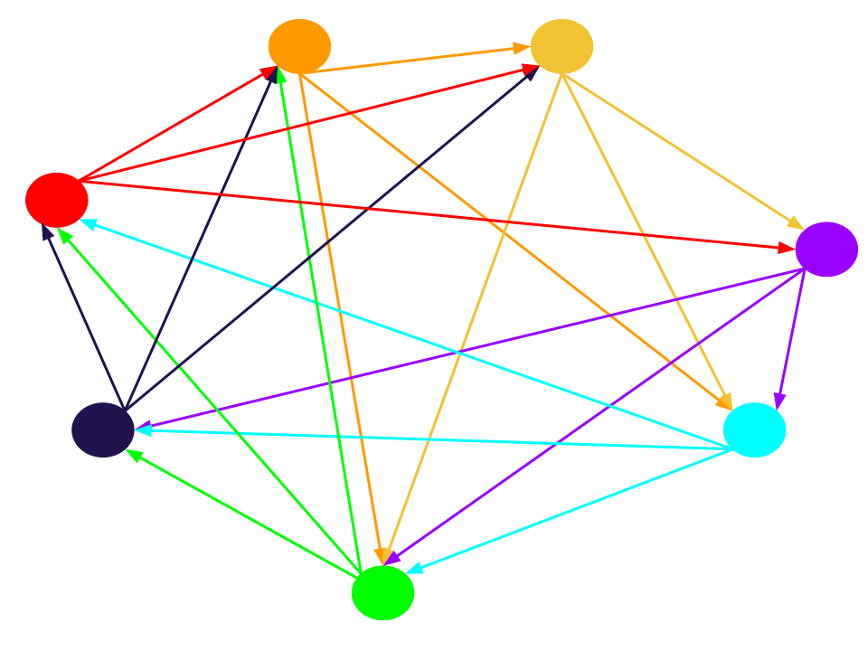
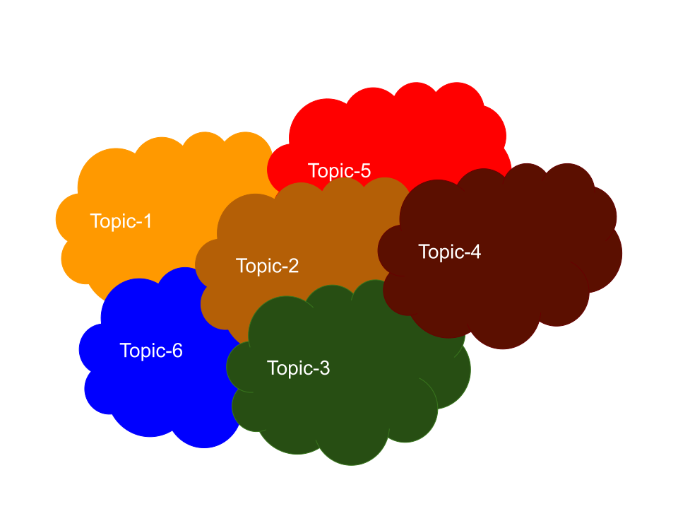

# Topology

## Definitions

In Flow, the term _topology_ captures the distributed protocol by which a node determines its fanout set. The _fanout set_ of a node is a subset of
other nodes in the system with whom the node interacts in the event of epidemic dissemination of information. The epidemic dissemination happens when a
node _multicasts_ or _broadcasts_ a message. The former refers to the event when a node sends a message targeted for a subgroup of nodes in the
system, while the latter refers to the event when a node aims at sending a message to the entire system. (Topology algorithms are not used for direct one-to-one communication). Note that the communications over the fanout
set are assumed unidirectional from the node to its fanout set. The distributed and independent invocations of topology protocol on nodes of Flow
hence results in a _directed_ graph where the vertices are the Flow nodes, and the edges are the union of the fanout sets of the nodes. This directed 
graph is
called the _topology graph_. It is required that the topology graph is connected with a very high probability, where the probability is taken over the
number of times the topology is constructed. The topology is constructed once at the beginning of each epoch. Hence, it implies that the topology
construction protocol should result in a connected graph with a very high probability over the life-time of Flow, which theoretically is
infinitely-many epochs. In practice, we consider it as 2^30 many epochs. 

The figure below shows an example of a topology graph with 7 nodes in the Flow network, which is a directed and connected graph. There is a path 
between
every two nodes and traversing the topology graph with BFS or DFS visits all the vertices. Also, the fanout set of each node is colored the same as
the node itself, e.g., the fanout set of the red node is illustrated using red edges from it to other nodes of the network. Also, in this example,
every node has a fanout size of 3.

  

### [Topology Interface](../../network/topology.go)

The Topology interface provides a way to retrieve a topology for a node. It receives the approved list of nodes in the system and generates and returns the fanout of the
node. The current implementations of this topology interface are topic-based topology and randomized topology. Any future topology implementation must also implement this interface to be able to be plugged into the node.

### [TopicBasedTopology](../../network/topology/topicBasedTopology.go)

The topic-based topology breaks the communication space of Flow into topics, where each topic corresponds to a
single [channel](../../engine/channels.go). Running an instance of topic-based topology on a node generates a fanout set for _each topic_ the node is
subscribing to. As the result of independent invocations of topic-based topology on different nodes in Flow, several overlapping connected components
are shaped among the nodes, each corresponding to a single topic. The topology graph of the entire network is then the union of these connected
components. Since the individual topic-based components are connected, the entire topology graph of the network is also connected. The figure below
shows the general idea of building the topology graph of the system using connected components as it happens in the topic-based topology. The
topic-based topology provides deterministic connectedness among the nodes subscribing to a topic by creating a fanout of `(x+1)/2` per node using the
linear fanout function, where `x` is the number of nodes subscribed to the topic. In this way, the resulted graph component of the topic is guaranteed
with connectedness. The topic-based topology is the topology in effect of Flow at the moment. 

  

### [RandomizedTopology](../../network/topology/randomizedTopology.go)

The randomized-topology is similar to the topic-based topology, except that upon constructing a graph component for a topic, instead of choosing a 
fixed-size fanout per node, it selects the fanout of the node probabilistically using an _edge probability_, `p`. 
For the set of nodes subscribed to a topic, each node includes any other node in its fanout with the probability of `p`, hence, the expected fanout of 
a node on the graph component of a topic is `p * x` where `x` is the number of nodes subscribed to the topic. Choosing an appropriate edge probability 
(e.g., `0.05`) the randomized topology provides a connected graph with a very high probability (e.g., `1 - 2^-30`), while it needs drastically 
smaller fanout per node. The randomized topology is not yet in effect, however, it is planned to replace the topic-based topology soon to support the 
scalability of the network. 
