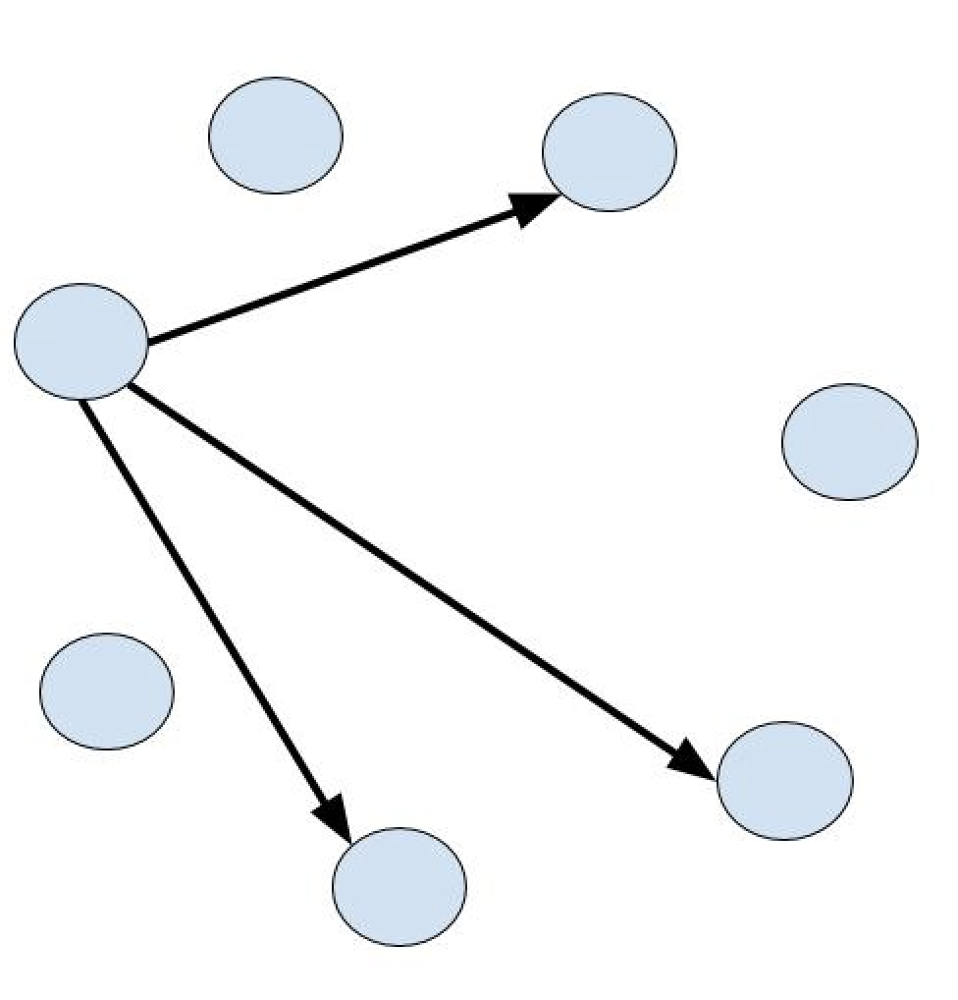

# Topology
In Flow, the term _topology_ captures the distributed protocol by which a node determines its
fanout set. The _fanout set_ of a node is a subset of other nodes in the system by which the node 
interacts in the event of epidemic dissemination of information. The epidemic dissemination happens when a 
node _multicasts_ or _broadcasts_ a message. The former refers to the event when a node sends a message
targeted for a subgroup of nodes in the system, while the latter refers to the event when a node aims on sending
a message to the entire system. 

