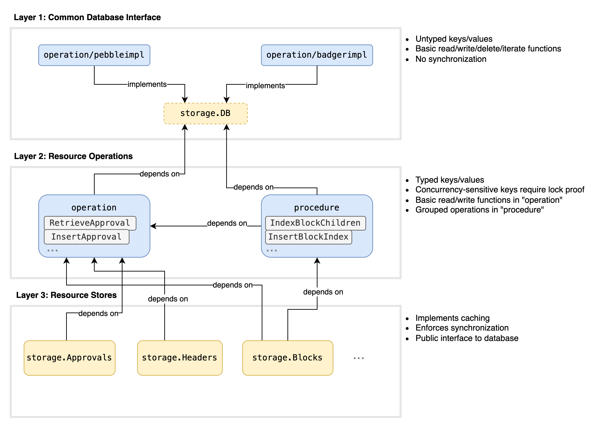
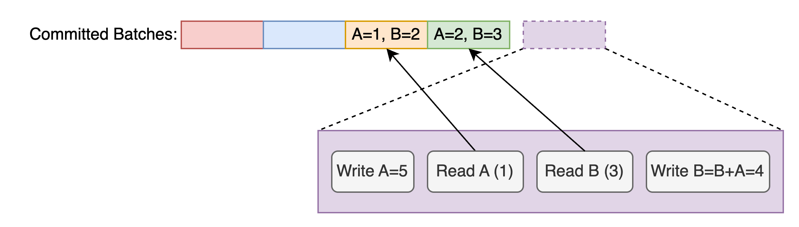

# Flow Storage

The storage package subtree (`./storage/**`) implements persistent data storage for Flow. 

## Overview
The storage layer is divided into layers:



[Diagram source](https://drive.google.com/file/d/1nF5k4RT78vRB8n5C5Nwalc2PdX-k2uKP/view?usp=sharing)

### 1. Common Database Interface
`storage.DB` defines an interface for direct interaction with a database backend.
This layer operates on keys and values as `[]byte` and is unaware of what resource types are being stored.
`pebbleimpl` and `badgerimpl` packages implement this interface for [Pebble](https://github.com/cockroachdb/pebble) and [Badger](https://github.com/hypermodeinc/badger) respectively.

Flow used Badger as the primary database backend until Mainnet26.
Flow began using Pebble as the primary database backend with Mainnet27, starting Oct 2025.

### 2. Resource Operations
The `operation` package implements basic low-level database operations.
Most exported function in `operation` is typically one read or write operation for a specific resource type.
Low-level storage operations which are always performed together can be combined into one exported "procedure" function.
In this case, the low-level operations used in the procedure should be private.

### 3. Resource Stores
The `store` package implements resource-level database operations.
Typically one resource type (eg. a `Block` or a `Collection`) has one corresponding resource store.
Caching, if applicable, is implemented at this layer.

## Best Practices

### Prefer content hash keys
We consider two types of keys:
1. Collision-resistant content hash of value (eg. `block.ID() -> block`) 
2. Index keys (eg. `finalizedHeight -> block.ID()`)

It is generally safe to upsert Type 1 keys without synchronization, because updates will not change existing values.
For this reason, **prefer Type 1 keys wherever possible**.

All Type 2 keys must be explicitly synchronized to protect against concurrent updates.

### Use functors to front-load expensive operations
If an operation function does not require any lock, it should immediately perform the storage operation and return an error.

If an operation function does require any lock, it should return a functor to allow deferring lock acquisition.
Expensive independent operations such as encoding and hashing should be performed immediately, outside the functor.

#### Example 1: Operation without lock
```go
func UpsertCollection(w storage.Writer, col *flow.LightCollection) error {
	return UpsertByKey(w, MakePrefix(codeCollection, col.ID()), col)
}
```

#### Example 2: Operation with lock
```go
func UpsertCollection(col *flow.LightCollection) func(lctx lockctx.Proof, rw storage.ReaderBatchWriter) error {
	id := col.ID()                        // compute the ID (hash) immediately before acquiring the lock
	key := MakePrefix(codeCollection, id)
	deferredUpsert := Upserting(key, col) // the Upserting function is a helper to perform encoding before acquiring the lock
	
	return func(lctx lockctx.Proof, rw storage.ReaderBatchWriter) error {
		// check lock context
		return deferredUpsert(rw)
	}
}
```


## Isolation
The common database interface (Layer 1) provides read-committed isolation and serializable atomic writes.

Write operations are grouped into write batches, which are committed atomically.

The `ReaderBatchWriter` is commonly used and provides both read and write methods.
CAUTION: Unlike Badger transactions, reads here observe the **latest committed state**.
- Reads DO NOT observe writes in the write batch
- Reads DO observe writes committed concurrently by other threads
- Subsequent reads of the same key DO NOT always observe the same value

### Badger Transaction (for reference only - no longer supported)
Badger (**no longer supported**) transactions read their own writes and read a consistent prior snapshot for the duration of the transaction.


### Pebble Write Batch
Pebble reads the latest committed state, which may change between subsequent reads.



## Synchronization with Lock Context Manager
The storage package exposes a `LockManager`, which must be a process-wide singleton.
All synchronized functions in the storage package should register their locks in [`storage/locks.go`](locks.go).
- High-level functions should acquire locks using a `lockctx.Context`
- Low-level functions should validate locks by accepting a `lockctx.Proof`

The `LockManager` enforces an ordering policy and guarantees deadlock-free operation.

For additional information, see [the package documentation](https://github.com/jordanschalm/lockctx).

#### Example: Contexts & Proofs
In this example, the high-level `storage.Blocks` uses ` lockctx.Context` to acquire necessary locks.
```go
func (blocks *Blocks) Insert(block *Block) {
	lctx := blocks.LockManager.NewContext()
	defer lctx.Release()
	
	lctx.AcquireLock(storage.LockInsertHeader)
	lctx.AcquireLock(storage.LockInsertPayload)

	blocks.db.WithReaderBatchWriter(func(batch) {
		operation.InsertHeader(lctx, block.Header)
		operation.InsertPayload(lctx, block.Payload)
	}
}
```
Then a `lockctx.Proof` is passed down to lower level functions, which validate the lock was acquired.
```go
func InsertHeader(lctx lockctx.Proof, header *Header) {
	if !lctx.HoldsLock(storage.LockInsertHeader) {
		// return error
	 }
	// insert header
}
func InsertPayload(lctx lockctx.Proof, payload *Payload) {
	if !lctx.HoldsLock(storage.LockInsertPayload) {
		// return error
	}
	// insert payload
}
```

